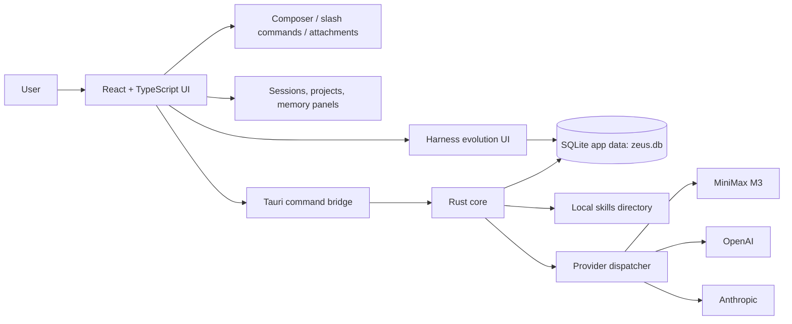

# Zeus — The God Coding Agent


Zeus is a local-first desktop coding-agent shell built with Tauri, React, TypeScript, and Rust. The current production-ready surface is a focused desktop task UI with real provider dispatch, MiniMax M3 chat, local SQLite-backed session state, skill discovery and injection, image/file attachment handling, project-scoped sessions, slash commands, and visible harness-evolution controls.

The app is intentionally honest about its current scope: Zeus is ready as a runnable desktop agent shell and provider/memory/harness foundation. It does **not** yet execute arbitrary local shell commands, apply repository file edits, enforce filesystem/network policies, or autonomously modify code end to end.

## Production-Ready and Wired In

These capabilities are present in the current codebase and wired through the app surface.

### Desktop App Foundation

- Tauri 2 desktop application with a React + TypeScript frontend and Rust backend.
- Compact three-panel coding-agent interface with Home, Sessions, Skills, Memory, Harness Evolution, and Settings views.
- Bottom composer designed as the only file-input surface.
- Composer grows upward from a compact one-line input and keeps the task screen inside a single viewport.
- Run/stop state for active chat requests.
- Cross-platform build configuration through Tauri scripts.

### Provider Dispatch and Chat

- Rust-side provider trait and dispatcher for chat backends.
- Built-in provider registry for MiniMax, OpenAI, and Anthropic on the Rust side.
- MiniMax M3 is the default wired frontend provider.
- MiniMax calls use the OpenAI-compatible chat-completions endpoint at `https://api.minimax.io/v1` and read `MINIMAX_API_KEY` from the environment.
- OpenAI and Anthropic Rust providers are registered and implement real API request paths using `OPENAI_API_KEY` and `ANTHROPIC_API_KEY` respectively.
- Provider responses are normalized into a shared `{ content, model, usage }` shape.
- MiniMax reasoning blocks are stripped before being shown to the user.
- Missing API keys and provider failures return public errors without exposing secret values.

### Local Persistence and Memory Foundation

- SQLite database is opened inside the Tauri app data directory as `zeus.db`.
- Schema initialization and idempotent migrations are wired in Rust.
- Persistent tables exist for harness proposals, harness history, access mode, and sessions.
- Sessions store label, project id/name, last-seen timestamp, serialized chat transcript, and compact-context anchor.
- Access mode is persisted so the selected mode survives relaunch.
- A default harness proposal is seeded on first run.

### Sessions, Projects, and Context

- New sessions are created from the UI and saved to SQLite.
- Recent sessions are restored from Rust on app startup.
- Session rename is wired from the sidebar and persisted.
- Project grouping is available through `projectId` and `projectName` on sessions.
- New project creation is available from the UI and sessions can be grouped under projects.
- `/new` starts a new session.
- `/compact` keeps the recent chat window and stores a compact anchor so older turns stop being sent to the model.
- Context sent to providers is built from the persisted chat window and excludes UI-only thinking placeholders.
- `/goal` sets or displays an active session goal and surfaces it in the Memory view.

### Skills System

- Skills are discovered recursively from a configurable/local skills directory, so categorized skill packs are supported.
- `ZEUS_SKILLS_DIR` is supported, with packaged resource and development-directory fallbacks.
- Skill folders are validated by `SKILL.md` files with YAML frontmatter.
- Skill summaries include id, name, description, and whether references, scripts, assets, or OpenAI agent metadata are present.
- Invalid skill folders are skipped instead of blocking the whole registry load.
- Skill details can be loaded from the UI.
- Active skill instructions are injected on the Rust side into the next provider call rather than shipping full skill bodies through frontend state.
- Manual slash-selected skills take precedence. When no manual skill is active, Zeus automatically scores the latest user request against each skill's `name` and `description`, then injects up to three high-confidence matching skills.
- Skills with `disable-model-invocation: true` are available in the picker but skipped by automatic matching.
- Skill chips are excluded from ordinary chat-history context because the active skill body is injected separately.

### Attachments and Image Paste

- Bottom composer file attachment handling is wired.
- Pasted images from the clipboard are converted into image attachments.
- Image attachments get preview URLs when the runtime supports them.
- Attached files are included in the prompt as structured attachment metadata for the current turn.
- Attachments clear after a successful provider response.

### Workspace Tool Execution

- `/run <command>`, `/read <path>`, `/write <path> :: <content>`, and
  `/edit <path> :: <find> => <replace>` slash commands dispatch to the
  Rust `run_shell_command`, `read_workspace_file`, `write_workspace_file`,
  and `apply_workspace_edit` Tauri commands. Results land as a chat bubble
  AND in the Tool Run panel below the composer.
- The Tool Run panel renders `ShellCommandResult` (exit code, duration,
  stdout/stderr toggle), `WriteWorkspaceFileResult` / `ApplyWorkspaceEditResult`
  (unified diff with `-` / `+` lines), and `AgentRunResult` (combined diff,
  files touched, step log, rollback plan, and any proposed harness rule).
- Policy decisions (`CommandClass`, `accessMode`, `approvalRequired`) are
  rendered as colored badges; `run_shell_command` and `run_agent_task`
  route through `authorize_command` and `authorize_file_write` so the
  access-mode setting actually gates what runs.
- The chat model can emit a fenced `tool` block (one JSON step per line:
  `readFile`, `writeFile`, `editFile`, `runCommand`) to invoke the agent
  loop. The composer parses it after each response and calls
  `runAgentTask`; the resulting `proposedHarnessRule` (when present)
  becomes a pending proposal in the Harness Evolution view.
- Multi-turn chaining: after `runAgentTask` returns, the chat driver
  re-prompts the model with the tool result appended to the conversation
  history (recursive `runChatTurn`, bounded by `MAX_TOOL_TURNS = 6`).
  The model can emit another `tool` block to chain actions or finally
  emit a plain-text summary. Each turn gets its own thinking bubble and
  its own Tool Run panel entry.
- Provider API keys: Settings exposes password-style inputs for
  `MINIMAX_API_KEY` / `OPENAI_API_KEY` / `ANTHROPIC_API_KEY`. Saved keys
  land in `<app_data>/provider-keys.json` and are injected into the
  process env at startup so chat requests don't fail with "Missing API
  key". The frontend never sees the raw key value.

### Harness Evolution Workflow

- Harness proposal state is visible in the UI.
- Proposal transitions support approved, rejected, applied-once, edited, and rolled-back states.
- Proposal edits can be made inline from the UI.
- Proposal history entries are recorded for auditability.
- Rust persistence supports proposal edits, history snapshots, and rollback behavior.
- A seeded proposal appears automatically on first run so the harness panel is never empty.

### Access Modes

- Access modes are exposed in the UI: Full, Local, Review, and Locked.
- Mode descriptions are shown in the app.
- The selected access mode is persisted through Rust/SQLite.

Important limitation: access modes are currently persisted UI state. They do not yet enforce shell, filesystem, network, dependency, or prompt-injection policies.

### Testing and Quality Gates

The repository includes scripts for:

```bash
npm run typecheck
npm run test
npm run build
npm run tauri:build
cd src-tauri && cargo test
cd src-tauri && cargo fmt -- --check
```

Current tests cover the frontend shell, composer behavior, session/project flows, slash commands, harness proposal editing, context-window helpers, provider dispatch, skill injection, persistence, and provider defaults.

## Not Yet Production Ready

The following are intentionally **not** described as production-ready:

- Signed multi-platform release publishing (CI workflow scaffold lives in
  the shell/exec branch but is intentionally not wired into the default
  build).

Everything else from earlier "not ready" lists is now wired end-to-end:

- Arbitrary local shell command execution: `/run <command>` from the
  composer dispatches to `run_shell_command`; the result is shown in the
  chat, the Tool Run panel, and the persisted session. The model can also
  emit a fenced `tool` block that runs shell steps via `runAgentTask`.
- Repository file editing / patch application: `/read`, `/write`, `/edit`
  slash commands plus `readFile`/`writeFile`/`editFile` tool steps land in
  the same place; `WriteWorkspaceFileResult` and `ApplyWorkspaceEditResult`
  return unified diffs that the Tool Run panel renders.
- Policy-enforced filesystem / shell / dependency / network guards:
  `PolicyDecision` (command class, access mode, approval state) is
  returned from every shell run and surfaced as a colored badge in the
  panel; `run_shell_command` and `run_agent_task` route through
  `authorize_command` and `authorize_file_write` before touching the FS.
- Autonomous code-change loops that modify a repo end to end:
  `runAgentTask` orchestrates read/write/edit/runCommand steps with
  rollback plans, captured diffs, and a step log; the model can trigger it
  by emitting a fenced `tool` block; the panel shows the full log and the
  combined diff.
- Diff/log panels for real task execution: the Tool Run panel below the
  composer renders `DiffBlock` (unified diff from Rust) plus a
  numbered step log; the chat bubble also gets a short summary line.
- Automatic harness-rule generation from completed sessions: when
  `runAgentTask` returns `proposedHarnessRule`, the chat replaces the
  pending proposal with one derived from it; the rule shows up in the
  Harness Evolution panel for the user to approve/edit/reject.
- Multi-turn tool-calling loop: the chat driver recursively re-prompts
  the model with the tool result, bounded by `MAX_TOOL_TURNS = 6`. The
  model can chain any number of tool blocks within one user request and
  finally emit a plain-text summary; the user sees each tool result as
  its own chat bubble plus a panel entry.
- Provider API key management: the Settings panel exposes password-style
  inputs for `MINIMAX_API_KEY`, `OPENAI_API_KEY`, and `ANTHROPIC_API_KEY`;
  keys are persisted to `<app_data>/provider-keys.json` and injected into
  the process env at startup so chat requests no longer fail silently
  with "Missing API key". Chat errors that look like key/auth issues
  surface a clear pointer to the Settings panel.

## Architecture



The frontend owns the visual shell, composer, views, temporary UI state, and provider-facing context assembly. The Rust core owns native commands, SQLite persistence, provider dispatch, provider HTTP calls, skill discovery, and skill injection.

## Prerequisites

| Requirement | Notes |
| --- | --- |
| Node.js | Node.js 22 or newer is recommended. |
| npm | Used for frontend dependencies and scripts. |
| Rust stable | Required by Tauri. Install with `rustup`. |
| Cargo | Installed with Rust and used for the Tauri/Rust core. |
| Git | Required to clone and contribute to the repository. |
| WebView runtime | Windows needs Microsoft Edge WebView2 Runtime. Current Windows 10/11 machines usually already have it. |
| C++ build tools on Windows | Install Microsoft Visual Studio Build Tools with the Desktop development with C++ workload if Rust native dependencies fail to compile. |
| Xcode tools on macOS | Install Xcode Command Line Tools with `xcode-select --install`. |
| Linux Tauri packages | Install WebKitGTK, AppIndicator, librsvg, and build tooling for your distro. |
| Provider API key | Required for live provider calls. MiniMax uses `MINIMAX_API_KEY`; OpenAI uses `OPENAI_API_KEY`; Anthropic uses `ANTHROPIC_API_KEY`. |

Ubuntu packaging dependencies:

```bash
sudo apt-get update
sudo apt-get install -y \
  libwebkit2gtk-4.1-dev \
  libappindicator3-dev \
  librsvg2-dev \
  patchelf \
  build-essential \
  pkg-config \
  curl \
  wget \
  file
```

## Installation

```bash
git clone https://github.com/benclawbot/Zeus.git
cd Zeus
npm install
```

Configure a provider key for live chat:

```bash
cp .env.example .env
# add MINIMAX_API_KEY=your_key_here
# optionally add OPENAI_API_KEY=... or ANTHROPIC_API_KEY=...
```

Run the web dev surface:

```bash
npm run dev
```

Run the Tauri desktop app:

```bash
npm run tauri:dev
```

Build the frontend:

```bash
npm run build
```

Package the desktop app:

```bash
npm run tauri:build
```

## Development Commands

```bash
npm run typecheck
npm run test
npm run build
npm run tauri:build
cd src-tauri && cargo test
cd src-tauri && cargo fmt -- --check
```

## Configuration

### Provider Keys

Zeus reads provider keys from the process environment. `.env` is loaded on startup when present.

```bash
MINIMAX_API_KEY=your_minimax_key
OPENAI_API_KEY=your_openai_key
ANTHROPIC_API_KEY=your_anthropic_key
```

### Skills Directory

Set `ZEUS_SKILLS_DIR` to point Zeus at a local skills folder:

```bash
ZEUS_SKILLS_DIR=/path/to/skills
```

If unset, Zeus checks packaged resources and development paths.

The bundled skills are organized by category. Keep each skill description narrow: it is used for automatic context matching, so broad generic trigger words can make unrelated skills compete.

## Suggested GitHub Description

Use this as the repository description:

```text
Local-first Tauri coding-agent shell with MiniMax M3, SQLite sessions, skills, attachments, and visible harness evolution.
```

## Security Notes

- Do not commit `.env` or local API keys.
- Provider calls are routed through the Rust side so secrets can stay in the process environment rather than frontend code.
- Access modes are currently persisted UI state only. Enforcement of shell, file, network, dependency, and secret policies is future work.
