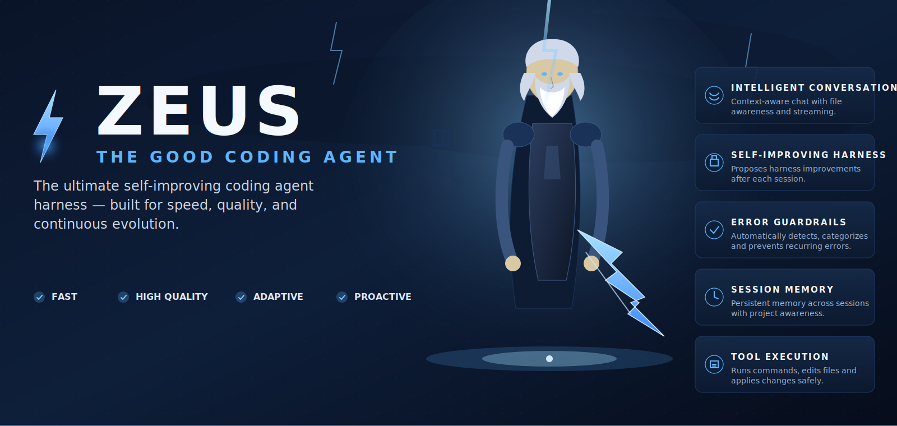
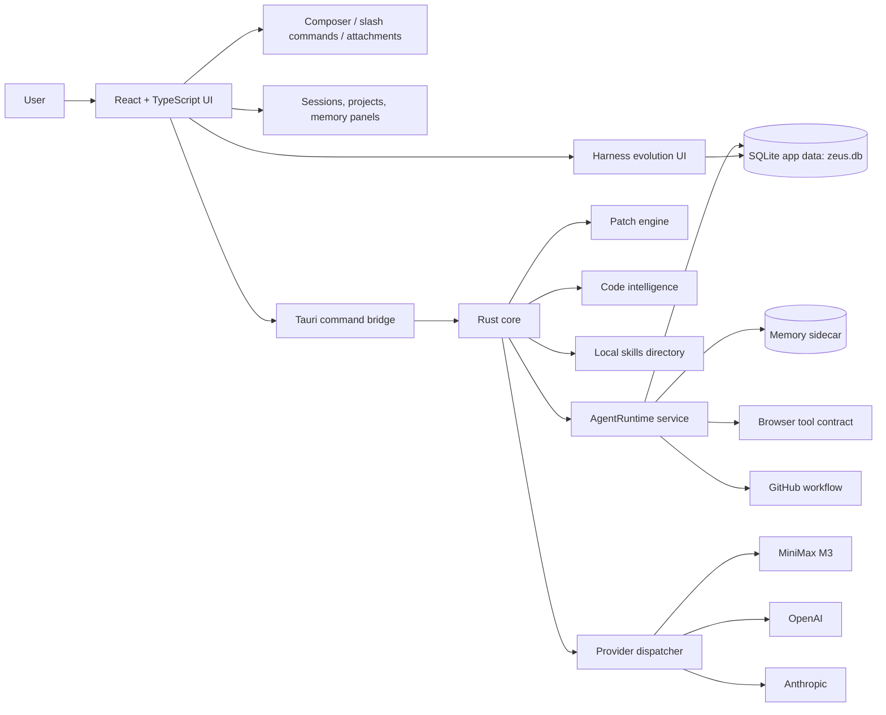

# ⚡ Zeus — The Good Coding Agent

<p align="center">
  
</p>

<p align="center">
  
  
  
  
  
  
</p>

> Zeus is a next-generation coding agent harness that helps you build better software, faster. It combines intelligent automation, self-improvement, and robust guardrails to deliver a reliable and continuously evolving development partner.

Zeus is a **local-first desktop coding-agent shell** built with **Tauri 2 + React + TypeScript + Rust**. The current production surface is a three-panel desktop UI with real provider dispatch (MiniMax, OpenAI, Anthropic), SQLite-backed session state, a Rust agent-runtime service with an approval queue and structured observations, a transactional multi-file patch engine, semantic code search, skill discovery and injection, image and file attachments, project-scoped sessions, slash commands, harness evolution, and visible tool-run panels.

---

## ✅ Production Ready — What's Built & Wired In

<table>
<tr>
<td width="33%" valign="top">

### 💬 Intelligent Conversation
Streaming chat with full project context, file awareness, and automatic skill injection. Provider keys for MiniMax, OpenAI, and Anthropic are managed in Settings and never leak through frontend state.

</td>
<td width="33%" valign="top">

### 🧠 Agent Runtime Service
A persistent Rust runtime owns sessions, active plans, tool-run records, approvals, browser sessions, project memories, and structured code-search observations. Frontend talks to it through a typed Tauri command bridge.

</td>
<td width="33%" valign="top">

### 🩹 Transactional Patch Engine
`apply_patch` accepts a multi-file unified-diff blob, validates every hunk against the on-disk content, stages every change in memory, and only writes if every file applies cleanly. If any write fails, every previously-modified file is restored to its pre-patch content.

</td>
</tr>
<tr>
<td width="33%" valign="top">

### 🔍 Structured Code Search
`search_code` scans source files and returns path, line number, snippet, nearest detected symbol, and whether the file was already read — so the agent can navigate a workspace without re-reading whole files.

</td>
<td width="33%" valign="top">

### 🛡 Approval Queue
Risky tool calls become `PendingApproval` records with risk class, human-readable action labels, affected files, and an optional diff preview. The runtime supports `approved once`, `approved for session`, `rejected`, and `pending` transitions.

</td>
<td width="33%" valign="top">

### 🌐 Semantic Browser Tool
One tool, eight actions: `status`, `open`, `snapshot`, `click`, `type`, `screenshot`, `eval`, `run_test`. The contract is provider-agnostic; a Playwright adapter can back it with real DOM snapshots and artifacts.

</td>
</tr>
<tr>
<td width="33%" valign="top">

### 🔭 Autonomous Web Search
`webSearch` returns ranked title + URL + snippet hits — no API key required. The installer ships a self-contained `ddgs` sidecar next to `zeus.exe` (Python + ddgs + curl-cffi bundled into one binary), which uses a real-browser TLS fingerprint to bypass DuckDuckGo's anomaly detector. End users don't need Python or `pip install` — the sidecar is bundled. Power users can point `ZEUS_DDGS_BIN` at a custom build, or fall back to a self-hosted SearXNG instance via `ZEUS_SEARCH_PROVIDER=searxng` + `ZEUS_SEARXNG_URL=<base>`. When the auto-detected provider errors out at runtime, Zeus retries the next provider (`ddgs → searxng → duckduckgo`) so a single transient failure doesn't break the agent loop. The model can emit `webSearch {"query":"..."}` from any chat turn to pull external context for research, doc lookups, or competitive analysis without leaving the composer.

</td>
<td width="33%" valign="top">

### 🧠 Memory Sidecar
Project-scoped retrieval with source / provenance, tags, stale flags, and supersession links. Deterministic lexical matching for now so it stays local and testable; embeddings can drop in later behind the same interface.

</td>
<td width="33%" valign="top">

### 📊 Project Awareness
Reads `package.json`, `pyproject.toml`, `Cargo.toml`, `go.mod`, and `pom.xml`. Walks up from the workspace root and surfaces the parsed config to the model.

</td>
<td width="33%" valign="top">

### 🪪 GitHub Workflow Integration
Local `git` operations route through a typed policy gate with read-only / mutating classification. A separate `github_workflow` module is wired for repository-level automation tasks.

</td>
</tr>
<tr>
<td width="33%" valign="top">

### ⚡ Tool Execution
Runs shell commands, applies search-and-replace edits, writes files with `expectedText` guards, lists directories, runs the project's test runner, and performs read-only or mutating `git` operations — all gated by access-mode policy.

</td>
<td width="33%" valign="top">

### 🛡 Error Guardrails
The `validation` module and the agent runtime's structured failure observations give the model typed signals (workspace, argument, policy, transient, unknown) so a failed tool is an observation to re-plan from, not a hard stop.

</td>
<td width="33%" valign="top">

### 🗂 Harness Evolution
Harness proposals persist across sessions with full approve / reject / edit / apply-once / rollback state. Every change is snapshotted into `harness_history` so a rollback always restores the prior body.

</td>
</tr>
</table>

---

## Desktop App Foundation

- Tauri 2 desktop application with a React + TypeScript frontend and Rust backend.
- Compact three-panel coding-agent interface with **Home**, **Sessions**, **Skills**, **Memory**, **Harness Evolution**, and **Settings** views.
- Bottom composer designed as the only file-input surface; grows upward from a compact one-line input.
- Run / stop state for active chat requests, an in-progress agent-run progress bubble, and a visible tool-run panel.
- Cross-platform build configuration through Tauri scripts.

## Provider Dispatch and Chat

- Rust-side provider trait and dispatcher for chat backends.
- Built-in provider registry for **MiniMax**, **OpenAI**, and **Anthropic** on the Rust side.
- MiniMax M3 is the default wired frontend provider, calling the OpenAI-compatible chat-completions endpoint at `https://api.minimax.io/v1`.
- Provider API keys are managed in Settings: password-style inputs save to `<app_data>/provider-keys.json` and are injected into the process env at startup.
- Provider responses are normalized into a shared `{ content, model, usage }` shape; reasoning blocks are stripped before display.
- Missing API keys and provider failures return public errors without exposing secret values.

## Agent Runtime Service

- Persistent Rust service (`src-tauri/src/agent_runtime.rs`) owns sessions, plans, tool-run records, approvals, browser sessions, project memories, and structured code-search observations.
- Tauri command bridge (`src-tauri/src/agent_runtime_commands.rs`) exposes runtime health, status, sessions, plans, approvals, browser actions, memory, and structured search to the React app.
- React client lives at `src/providers/agentRuntime.ts`; the bounded observe-and-replan driver is in `src/agentRuntimeDeepLoop.ts`.
- Approval queue: model-generated tool blocks become `PendingApproval` records with risk class, action labels, affected files, and an optional diff preview before risky execution proceeds.
- Agent loop policy (see `docs/agent-loop-and-browser-testing.md`): a failed tool result is an observation, the next iteration classifies it as workspace / argument / policy / transient / unknown, re-plans with the failure output, and only stops after the bounded recovery budget is exhausted or a policy guard requires a human decision.

## Workspace Tool Execution

- Slash commands `/run`, `/read`, `/write`, `/edit`, `/ls`, `/git`, `/test`, `/config`, `/goal`, `/compact`, `/new`, `/stop` all dispatch to typed Rust Tauri commands.
- The chat model can also emit a fenced `` ```tool ``` `` block listing JSON steps; the composer parses it after each response and calls `runAgentTask`.
- Results land as a chat bubble **and** in the Tool Run panel below the composer.
- The Tool Run panel renders `ShellCommandResult`, `WriteWorkspaceFileResult`, `ApplyWorkspaceEditResult`, and `AgentRunResult` with diffs, files touched, step logs, rollback plans, and any proposed harness rule.
- Multi-turn chaining: after `runAgentTask` returns, the chat driver re-prompts the model with the tool result appended to the conversation history (recursive `runChatTurn`, bounded by `MAX_TOOL_TURNS = 6`).

### Transactional Patch Engine

- `src-tauri/src/patch.rs` accepts a multi-file unified-diff blob, parses it into `ApplyPatchFile` entries, validates every hunk against the on-disk content, stages every change in memory, and only writes if every file applies cleanly.
- If any write fails, every previously-modified file is restored to its pre-patch content so the repo is never left half-modified.
- Diff format: `--- a/<path>` / `+++ b/<path>` headers, `@@ -old_start,old_count +new_start,new_count @@` hunk headers, ` `/`-`/`+` line prefixes, with `\ No newline at end of file` markers tolerated.

### Code Intelligence and Search

- Server-side regex-based structural indexer in `src-tauri/src/code_intelligence.rs` and the matching TypeScript library at `src/providers/codeGraph.ts`.
- `search_code` returns path, line, snippet, nearest symbol, and a "was this file already read" flag.
- Outline extraction covers TypeScript / JavaScript, Rust, and Python with symbol classification for `function`, `method`, `class`, `interface`, `type`, `const`, `enum`, `struct`, `trait`, `mod`, and `macro`.

## Harness Evolution Workflow

- Harness proposal state is visible in the UI with approve / reject / edit / apply-once / rollback actions.
- Proposal edits can be made inline; every action records a `harness_history` row with a body snapshot.
- A default proposal is seeded on first run so the panel is never empty.
- When `runAgentTask` returns a `proposedHarnessRule`, the chat replaces the pending proposal with one derived from it.

## Access Modes

- Access modes are exposed in the UI: **Full**, **Local**, **Review**, and **Locked**.
- Mode descriptions are shown in the app and persisted through Rust/SQLite.
- The `policy` module enforces shell, file-write, and approval gates at a binary allow/deny level.
- `Locked` denies every risky command class and every file write.
- `Review` requires explicit approval for both shell and file-write operations.
- `Full` and `Local` only require approval for known-risky program names.
- Command classification (`Safe`, `Dependency`, `Network`, `Destructive`, `Privileged`) drives the badge color in the Tool Run panel.

## Sessions, Projects, and Context

- New sessions are created from the UI and saved to SQLite.
- Recent sessions are restored from Rust on app startup.
- Session rename is wired from the sidebar and persisted.
- Project grouping is available through `projectId` and `projectName`.
- `/new` starts a new session; `/compact` keeps the recent chat window and stores a compact anchor so older turns stop being sent to the model.
- `/goal` sets or displays an active session goal and surfaces it in the Memory view.

## Skills System

- Skills are discovered recursively from a configurable/local skills directory, so categorized skill packs are supported.
- `ZEUS_SKILLS_DIR` is supported, with packaged resource and development-directory fallbacks.
- Skill folders are validated by `SKILL.md` files with YAML frontmatter.
- Active skill instructions are injected on the Rust side into the next provider call rather than shipping full skill bodies through frontend state.
- Manual slash-selected skills take precedence; otherwise Zeus scores the latest user request against each skill's `name` and `description` and injects up to three high-confidence matches.
- Skills with `disable-model-invocation: true` are available in the picker but skipped by automatic matching.

## Attachments and Image Paste

- Bottom composer file attachment handling is wired.
- Pasted images from the clipboard are converted into image attachments.
- Image attachments get preview URLs when the runtime supports them.
- Attached files are included in the prompt as structured attachment metadata for the current turn.
- Attachments clear after a successful provider response.

## Testing and Quality Gates

The repository includes scripts for:

```bash
npm run typecheck
npm run test
npm run build
npm run tauri:build
cd src-tauri && cargo test
cd src-tauri && cargo fmt -- --check
```

Current coverage spans the frontend shell, composer behavior, session/project flows, slash commands, harness proposal editing, context-window helpers, provider dispatch, skill injection, persistence, the agent runtime loop, the validation module, the patch engine, code-intelligence extraction, and provider defaults.

---

## Architecture



The frontend owns the visual shell, composer, views, temporary UI state, and provider-facing context assembly. The Rust core owns native commands, the agent runtime service, SQLite persistence, provider dispatch, provider HTTP calls, the patch engine, code intelligence, skill discovery, skill injection, and the policy gate that enforces the access modes.

---

## Prerequisites

| Requirement | Notes |
| --- | --- |
| Node.js | Node.js 22 or newer is recommended. |
| npm | Used for frontend dependencies and scripts. |
| Rust stable | Required by Tauri. Install with `rustup`. |
| Cargo | Installed with Rust and used for the Tauri/Rust core. |
| Git | Required to clone and contribute to the repository. |
| WebView runtime | Windows needs Microsoft Edge WebView2 Runtime. Current Windows 10/11 machines usually already have it. |
| C++ build tools on Windows | Install Microsoft Visual Studio Build Tools with the Desktop development with C++ workload if Rust native dependencies fail to compile. |
| Xcode tools on macOS | Install Xcode Command Line Tools with `xcode-select --install`. |
| Linux Tauri packages | Install WebKitGTK, AppIndicator, librsvg, and build tooling for your distro. |
| Provider API key | Required for live provider calls. MiniMax uses `MINIMAX_API_KEY`; OpenAI uses `OPENAI_API_KEY`; Anthropic uses `ANTHROPIC_API_KEY`. |

Ubuntu packaging dependencies:

```bash
sudo apt-get update
sudo apt-get install -y \
  libwebkit2gtk-4.1-dev \
  libappindicator3-dev \
  librsvg2-dev \
  patchelf \
  build-essential \
  pkg-config \
  curl \
  wget \
  file
```

---

## Installation

```bash
git clone https://github.com/benclawbot/Zeus.git
cd Zeus
npm install
```

Configure a provider key for live chat:

```bash
cp .env.example .env
# add MINIMAX_API_KEY=your_key_here
# optionally add OPENAI_API_KEY=... or ANTHROPIC_API_KEY=...
```

Run the web dev surface:

```bash
npm run dev
```

Run the Tauri desktop app:

```bash
npm run tauri:dev
```

Build the frontend:

```bash
npm run build
```

Package the desktop app:

```bash
npm run tauri:build
```

---

## Development Commands

```bash
npm run typecheck
npm run test
npm run build
npm run tauri:build
cd src-tauri && cargo test
cd src-tauri && cargo fmt -- --check
```

---

## Configuration

### Provider Keys

Zeus reads provider keys from the process environment. `.env` is loaded on startup when present.

```bash
MINIMAX_API_KEY=your_minimax_key
OPENAI_API_KEY=your_openai_key
ANTHROPIC_API_KEY=your_anthropic_key
```

### Skills Directory

Set `ZEUS_SKILLS_DIR` to point Zeus at a local skills folder:

```bash
ZEUS_SKILLS_DIR=/path/to/skills
```

If unset, Zeus checks packaged resources and development paths.

The bundled skills are organized by category. Keep each skill description narrow: it is used for automatic context matching, so broad generic trigger words can make unrelated skills compete.

---

## Suggested GitHub Description

Use this as the repository description:

```text
Local-first Tauri coding-agent shell with MiniMax M3, a Rust agent-runtime service, transactional multi-file patching, structured code search, an approval queue, and visible harness evolution.
```

---

## Security Notes

- Do not commit `.env` or local API keys.
- Provider calls are routed through the Rust side so secrets can stay in the process environment rather than frontend code.
- Access modes are persisted through SQLite and enforced at the Rust `policy` gate.
- File reads are not gated by policy (read-only); shell, file-write, and git-mutation operations all require policy + approval where applicable.
- The Tool Run panel surfaces every policy decision as a colored badge so the user can audit what ran and why.

---

## Suggested GitHub Topics

`tauri`, `coding-agent`, `minimax`, `openai`, `anthropic`, `react`, `typescript`, `rust`, `sqlite`, `self-improving`, `agent-harness`, `code-graph`, `unified-diff`, `semantic-search`, `agent-runtime`, `playwright`