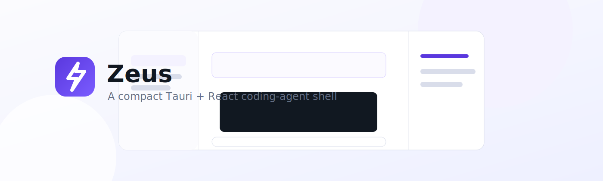

# Zeus — The God Coding Agent



Zeus is a local-first desktop coding-agent shell built with Tauri, React, TypeScript, and Rust. The current production-ready surface is a focused desktop task UI with real provider dispatch, MiniMax M3 chat, local SQLite-backed session state, skill discovery and injection, image/file attachment handling, project-scoped sessions, slash commands, visible harness-evolution controls, and guarded workspace execution.

## Production-Ready and Wired In

- Tauri 2 desktop app with React + TypeScript frontend and Rust backend.
- MiniMax M3 chat through the Rust provider dispatcher.
- Registered OpenAI and Anthropic Rust providers.
- SQLite-backed sessions, access mode, proposals, proposal history, and compact anchors.
- Session restore, rename, project grouping, `/new`, `/compact`, and `/goal`.
- Skill discovery, detail loading, metadata, and Rust-side skill injection.
- Composer attachments and pasted image previews.
- Harness proposal editing, transitions, history, and rollback persistence.
- Guarded local workspace execution:
  - shell command execution without shell-string interpolation,
  - workspace file reads,
  - workspace file writes,
  - find/replace file edits,
  - ordered agent task runs,
  - captured logs,
  - generated diffs,
  - rollback summaries,
  - proposed harness rule on failure.
- Access-mode-aware execution policy for Full, Local, Review, and Locked modes.
- Session working-directory control. Users can restrict shell/file/agent actions to a narrower folder than the app process directory.

## Workspace Execution

Zeus resolves the execution root in this order:

1. session working directory selected in the UI,
2. `ZEUS_WORKSPACE_DIR`,
3. the app process working directory.

Workspace paths are constrained to that root. Absolute paths and `..` traversal are rejected. Commands are executed as structured `program + args`, not through `sh -c`, `cmd /C`, or PowerShell string evaluation.

Access modes control execution blast radius:

| Mode | Behavior |
| --- | --- |
| Full | Safe, dependency, network, and destructive commands can run; privileged commands require approval. |
| Local | Safe commands can run; dependency, network, destructive, and privileged commands require approval. |
| Review | Shell commands and file writes require approval. |
| Locked | Shell commands and file writes are blocked. |

## Development Commands

```bash
npm install
npm run typecheck
npm run test
npm run build
npm run tauri:build
cd src-tauri && cargo test
cd src-tauri && cargo fmt -- --check
```

## Configuration

```bash
MINIMAX_API_KEY=your_minimax_key
OPENAI_API_KEY=your_openai_key
ANTHROPIC_API_KEY=your_anthropic_key
ZEUS_SKILLS_DIR=/path/to/skills
ZEUS_WORKSPACE_DIR=/path/to/default/workspace
```

## Security Notes

- Do not commit `.env` or local API keys.
- Provider calls are routed through Rust so secrets can stay in the process environment rather than frontend code.
- Workspace execution strips common secret-bearing environment variables from child processes.
- Workspace roots should be scoped as narrowly as practical per session.
