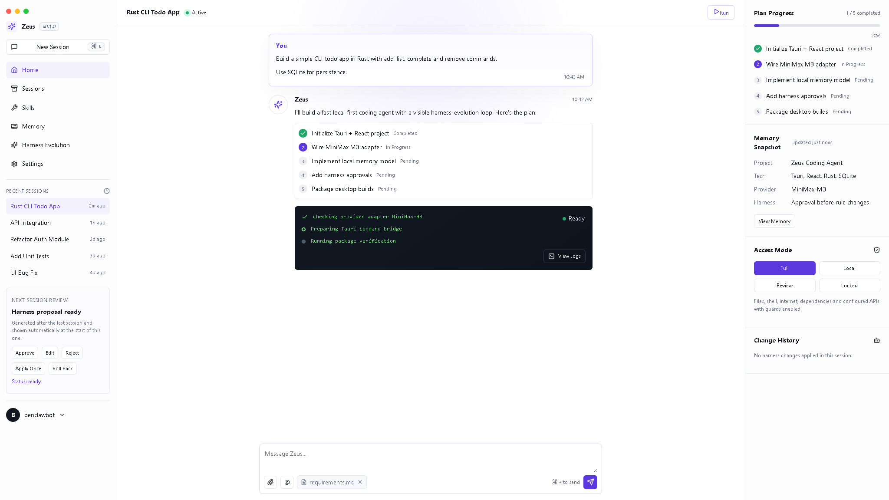
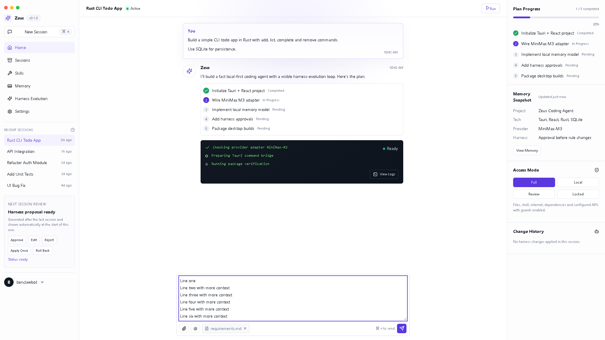
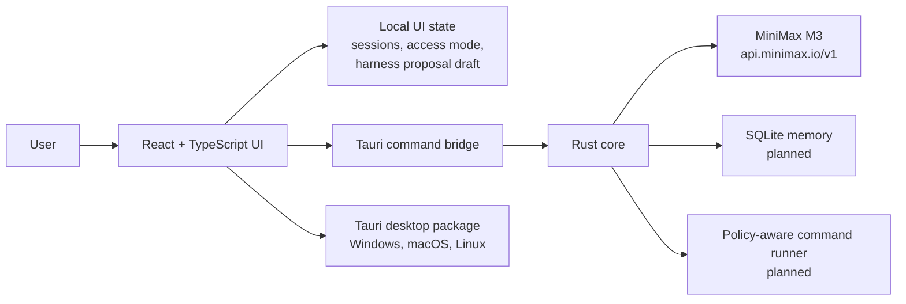

# Zeus


Zeus is a local-first desktop coding-agent shell built with Tauri, React, TypeScript, and Rust. The current build focuses on a compact Codex-like task screen, visible harness-evolution controls, access-mode state, local memory scaffolding, and a MiniMax M3 provider adapter wired through the Rust/Tauri bridge.

This repository is early but runnable. The shipped app is a desktop UI foundation with real build/test/package plumbing and a first provider adapter; it does not yet execute arbitrary local coding tasks end to end.

## Current Status

The first build is complete enough to run, test, and package on Windows. Cross-platform packaging is configured through Tauri and GitHub Actions for Windows, macOS, and Linux, though only the Windows local package was verified in this workspace.

Implemented today: compact three-panel Zeus shell, bottom-only file attachment controls, one-line composer that grows upward like Codex, harness proposal actions in UI state, access-mode selection, MiniMax M3 Rust command bridge, cross-platform icon assets, automated React/Rust tests, clean npm audit, and Windows MSI/NSIS packaging.

Not implemented yet: real session persistence, SQLite-backed memory tables, policy-enforced shell execution, diff/log panels, file attachment handling, and full harness-rule generation from completed sessions.

## Screenshots

Main Zeus task screen, constrained to one browser/window viewport with no body scrolling:



Composer growth check: the input starts as a compact one-line control and expands upward as more text is entered:



## Architecture



The frontend owns the current app shell, compact visual system, and temporary UI state. The Rust core owns native commands and provider calls. MiniMax M3 is exposed through a Tauri command that reads `MINIMAX_API_KEY`, defaults to `https://api.minimax.io/v1`, and sends OpenAI-compatible chat requests to `MiniMax-M3`.

## Prerequisites

You need these tools before running or packaging Zeus:

```bash
node --version
npm --version
rustc --version
cargo --version
```

Required versions and tools:

| Requirement | Notes |
| --- | --- |
| Node.js | Node.js 22 or newer is recommended. This build was verified with Node 24.13.0. |
| npm | Used for frontend dependencies and scripts. This build was verified with npm 11.6.2. |
| Rust stable | Required by Tauri. Install with `rustup` from https://rustup.rs/. |
| Cargo | Installed with Rust and used for the Tauri/Rust core. |
| Git | Required to clone and contribute to the repository. |
| WebView runtime | Windows needs Microsoft Edge WebView2 Runtime. Current Windows 10/11 machines usually already have it. |
| C++ build tools on Windows | Install Microsoft Visual Studio Build Tools with the Desktop development with C++ workload if Rust native dependencies fail to compile. |
| Xcode tools on macOS | Install Xcode Command Line Tools with `xcode-select --install`. |
| Linux Tauri packages | Install WebKitGTK, AppIndicator, librsvg, and build tooling for your distro. Ubuntu example below. |
| MiniMax API key | Required only for live MiniMax M3 calls. Set `MINIMAX_API_KEY` in your environment or `.env`. |

Ubuntu packaging dependencies:

```bash
sudo apt-get update
sudo apt-get install -y \
  libwebkit2gtk-4.1-dev \
  libappindicator3-dev \
  librsvg2-dev \
  patchelf \
  build-essential \
  pkg-config \
  curl \
  wget \
  file
```

Windows note: in this workspace Rust was installed at `C:\Users\thoma\.cargo\bin` but was not on the shell `PATH`. If commands cannot find Cargo, add that directory to `PATH` or launch a new terminal after installing Rust.

## Installation

Clone and install:

```bash
git clone https://github.com/benclawbot/Zeus.git
cd Zeus
npm install
```

Configure MiniMax if you want live provider calls:

```bash
cp .env.example .env
# add MINIMAX_API_KEY=your_key_here
```

Run the web dev surface:

```bash
npm run dev
```

Run the Tauri desktop app:

```bash
npm run tauri:dev
```

Build the frontend:

```bash
npm run build
```

Package the desktop app:

```bash
npm run tauri:build
```

On Windows, the verified local build produced `src-tauri/target/release/zeus.exe`, `src-tauri/target/release/bundle/msi/Zeus_0.1.0_x64_en-US.msi`, and `src-tauri/target/release/bundle/nsis/Zeus_0.1.0_x64-setup.exe`.

## Development Commands

```bash
npm run typecheck
npm run test
npm run build
npm run tauri:build
cd src-tauri && cargo test
cd src-tauri && cargo fmt -- --check
```

## Verification From This Build

The current tree was verified with TypeScript type checking, Vitest React tests, Vite production build, Rust unit tests, Rust formatting check, npm audit, runtime browser measurements, and Tauri packaging.

Browser viewport verification at 2048x1152 showed body overflow hidden, document height equal to viewport height, composer visible inside the window, no page vertical overflow, and no console errors. Composer verification showed the textarea starting at 24px high and growing to 148px with multi-line input while staying visible.

## Roadmap

Current: desktop shell, visual constraints, MiniMax M3 adapter, tests, packaging, screenshots, and documentation are complete for the first build.

Next: persist sessions, plans, memory snapshots, harness proposals, and change history in SQLite.

Next: implement the policy-aware Rust command runner for shell execution, file edits, network guards, secret guards, and dependency guardrails.

Next: add real file attachments from the bottom composer only, including attachment chips and context ingestion.

Next: add diff and log panels launched from running tasks.

Next: generate harness-evolution proposals after sessions and surface them automatically at the start of the next session.

Next: add model/provider settings for MiniMax and future OpenAI-compatible providers without storing secrets in committed files.

Next: verify packaging on macOS and Linux runners and publish signed release artifacts.

## Security Notes

Do not commit `.env` or local API keys. MiniMax calls are routed through the Rust side so the key can be read from the process environment instead of being bundled into the frontend.

Access modes are currently visible UI state. Enforcement of file, shell, network, dependency, and prompt-injection policies is planned work in the Rust core.
